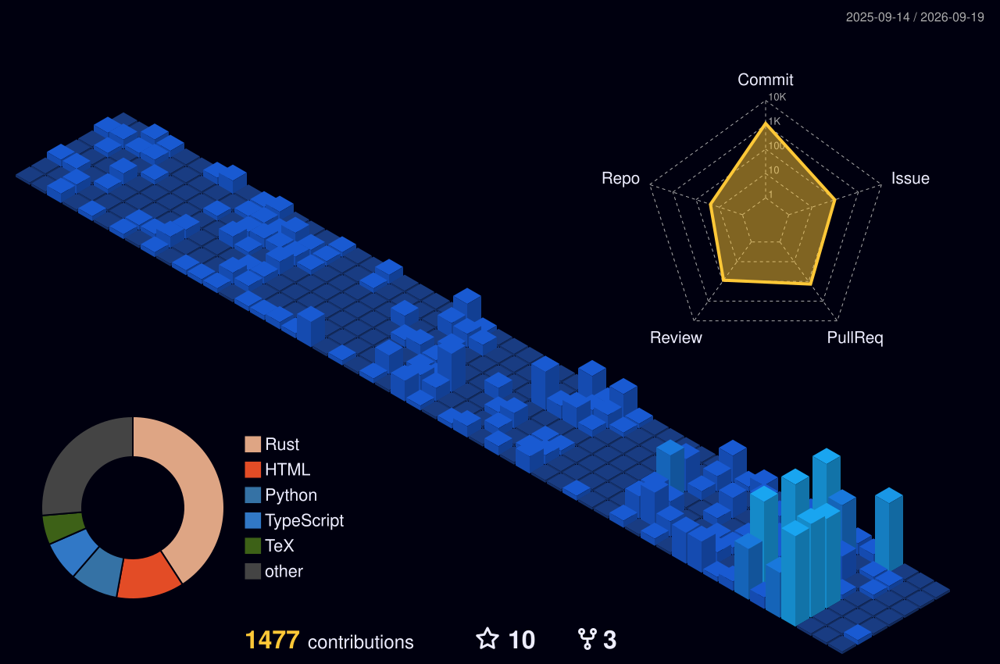

  

  Security researcher and open-source developer building tools around honeypots, 
  LLM services, and Trusted Execution Environments.

  
  &nbsp;
  
  &nbsp;
  

 

## Featured OSS

CURRENT PROJECT

### [PromptPot](https://github.com/ta-061/promptpot)

A multi-profile honeypot for exposed local LLM services including Ollama, LM Studio,
vLLM, Gradio, and ComfyUI. It emulates common LLM API surfaces and records probes and
submitted prompts — without running a model or executing attacker input.

`Python`&nbsp; `Docker`&nbsp; `T-Pot`&nbsp; `Threat Intelligence`

[Repository&nbsp;→](https://github.com/ta-061/promptpot) &nbsp;·&nbsp; [Project&nbsp;site&nbsp;→](https://promptpot.tatu-sec.dev)

 

## Published Research

REPRODUCIBILITY ARTIFACT

### [TEE Bad Partitioning LLM Artifact](https://github.com/ta-061/tee-bad-partitioning-llm-artifact)

Artifact for presented research on the complementarity of rule-based and LLM-based
bad-partitioning analysis in Trusted Applications.

`Program Analysis`&nbsp; `LLM Security`&nbsp; `Trusted Execution Environments`

[Repository&nbsp;→](https://github.com/ta-061/tee-bad-partitioning-llm-artifact)

 

  
<b>&nbsp;Activity</b>

   
  

    
  

---

  PYTHON&nbsp;&nbsp;·&nbsp;&nbsp;C/C++&nbsp;&nbsp;·&nbsp;&nbsp;TYPESCRIPT&nbsp;&nbsp;·&nbsp;&nbsp;DOCKER&nbsp;&nbsp;·&nbsp;&nbsp;LINUX

