<!-- Header -->
<h1 align="center">Hi 👋, I'm Tatsuya (ta-061)</h1>
<h3 align="center">AI × Security</h3>

---

## 🔗 Links & Activities

  <!-- Profile Views Counter -->
  
  <!-- X -->
  
  <!-- Qiita -->
  
  <!-- AtCoder -->
  

---

## 📊 GitHub Profile Summary Cards (by vn7n24fzkq)

  <!-- 1) Profile Details -->
  

  <!-- 2) Repos per Lang -->
  
  <!-- 3) Most Commit Lang -->
  

  <!-- 4) Stats -->
  
  <!-- 5) Productive Time -->
  

---

## 🎨 3D Contribution Graph

  <picture>
    <source media="(prefers-color-scheme: dark)"  srcset="profile-3d-contrib/profile-night-rainbow.svg" width="700" />
    <source media="(prefers-color-scheme: light)" srcset="profile-3d-contrib/profile-season-animate.svg" width="700" />
    
  </picture>

---

## 📈 Metrics (lowlighter/metrics)

  <picture>
    <source media="(prefers-color-scheme: dark)"  srcset="output/metrics.base.svg" width="420" />
    <source media="(prefers-color-scheme: light)" srcset="output/metrics.base.svg" width="420" />
    
  </picture>
  <picture>
    <source media="(prefers-color-scheme: dark)"  srcset="output/details.svg" width="420" />
    <source media="(prefers-color-scheme: light)" srcset="output/details.svg" width="420" />
    
  </picture>

---

## 🛠 Tech Stack

  

  

