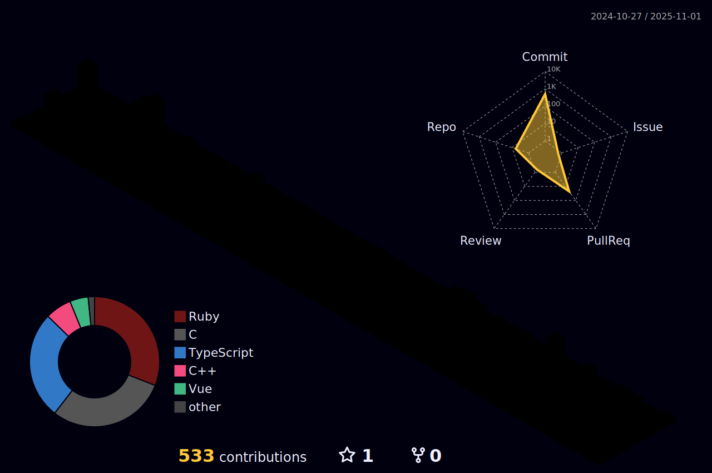

<!-- Header -->
<h1>Hi there 👋</h1>
<h3>AI × Security</h3>

---
## Stats

  <!-- X -->
  
  <!-- Qiita -->
  
  <!-- AtCoder -->
  

  <!-- 1) Profile Details -->
  

  <picture>
    <source media="(prefers-color-scheme: dark)"  srcset="profile-3d-contrib/profile-night-rainbow.svg" width="700" />
    <source media="(prefers-color-scheme: light)" srcset="profile-3d-contrib/profile-season-animate.svg" width="700" />
    
  </picture>

  <picture>
    <source media="(prefers-color-scheme: dark)"  srcset="output/metrics.base.svg" width="420" />
    <source media="(prefers-color-scheme: light)" srcset="output/metrics.base.svg" width="420" />
    
  </picture>
  <picture>
    <source media="(prefers-color-scheme: dark)"  srcset="output/details.svg" width="420" />
    <source media="(prefers-color-scheme: light)" srcset="output/details.svg" width="420" />
    
  </picture>

---

## 🛠 Tech Stack

  

  

